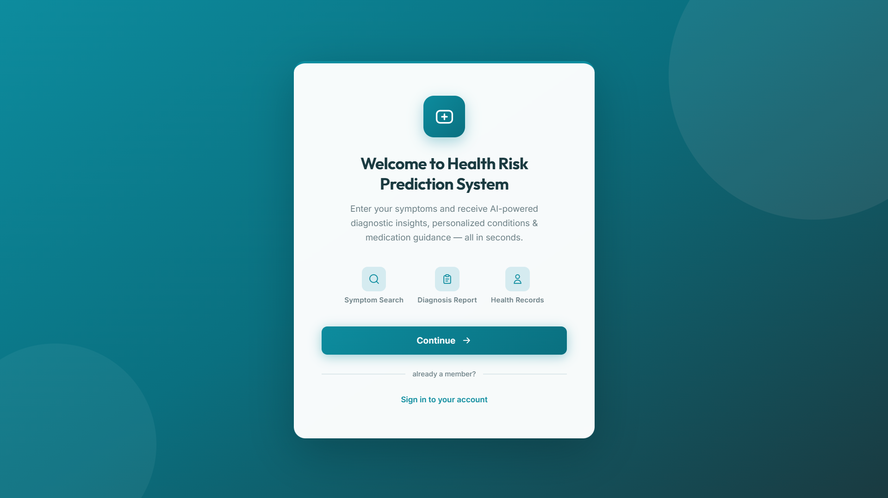
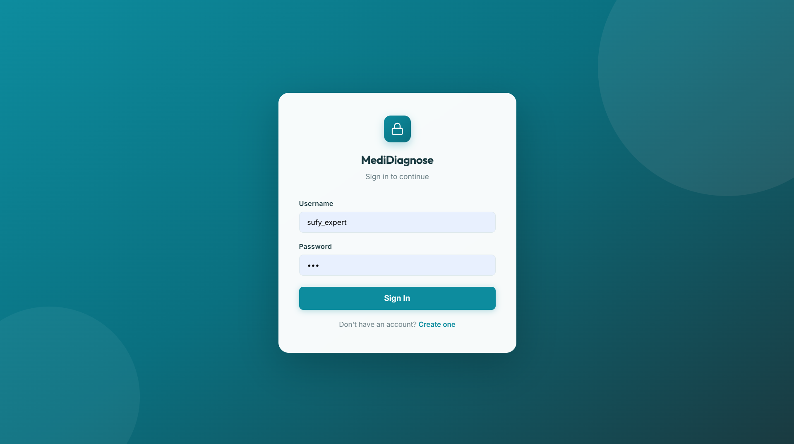
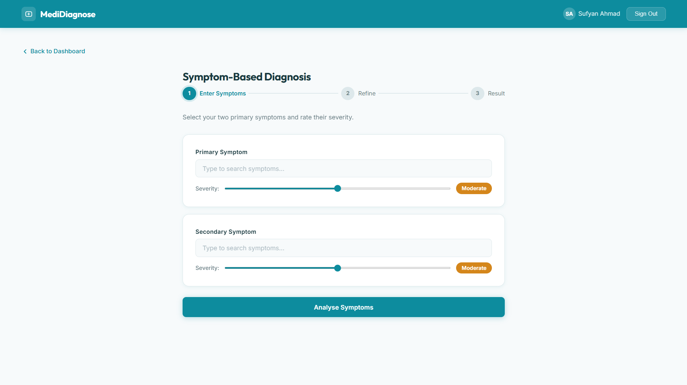
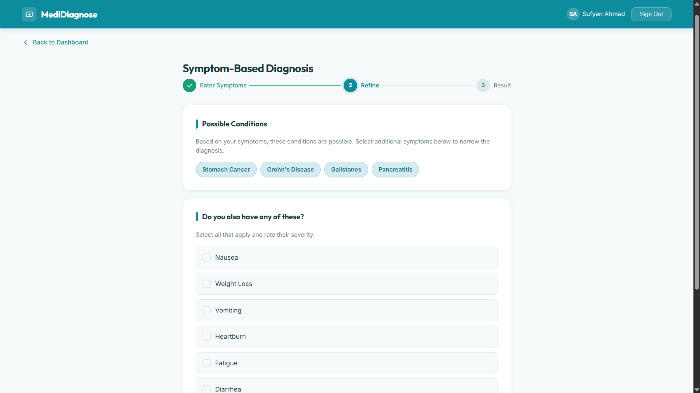
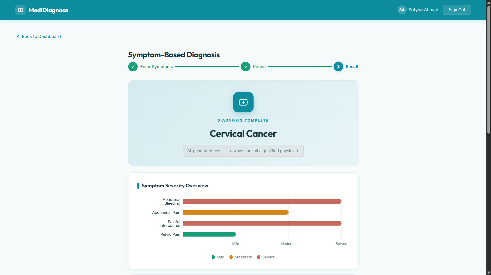
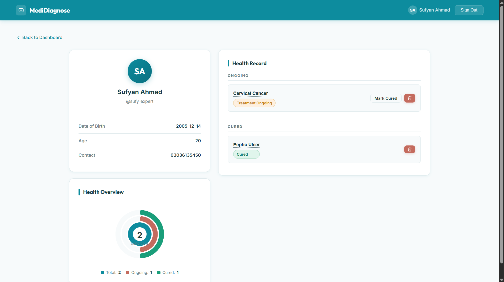

# 🏥 Medical Diagnostic System — Version 2

A full-stack AI-powered medical diagnostic web application. Users enter their symptoms and receive ranked disease predictions with dosage-specific medicine recommendations and suggested lab tests — all personalised by age.

---

## 📸 Screenshots

### Welcome Screen


### Sign Up


### Symptom Diagnosis



### Diagnostic Report


### User Profile


---

## 🛠 Tech Stack

| Layer     | Technology                                      |
|-----------|-------------------------------------------------|
| Frontend  | React.js, React Router, CSS (custom)            |
| Backend   | Python, Flask, Flask-CORS                       |
| Databases | MongoDB (users & sessions), Neo4j (knowledge graph) |
| ML / AI   | scikit-learn (Random Forest Classifier), NumPy  |
| Auth      | bcrypt password hashing                         |
| Config    | python-dotenv                                   |

---

## 🧠 Core Concepts

### Knowledge Graph (Neo4j)
The medical knowledge base lives in a Neo4j graph database with the following schema:

```
(Disease) -[:HAS_SYMPTOM]-> (Symptom)   { weight, probability }
(Disease) -[:TREATED_BY]->  (Medicine)  { adult/child/elderly dosage, note }
(Disease) -[:DIAGNOSED_BY]-> (Test)
```

At startup, the entire graph is loaded into memory for fast inference.

### Random Forest Classifier
- Built dynamically from the Neo4j knowledge base at server startup.
- Features: symptom presence/severity per disease.
- Output: top-N ranked disease predictions with confidence scores.
- Training uses data augmentation (noise injection) for better generalisation.

### Bayesian-Style Scoring
Alongside the RF model, a probabilistic symptom-match scorer ranks diseases by weighted symptom overlap and co-occurrence probability — results from both approaches are blended.

### Age-Aware Dosage
Medicine recommendations automatically select the correct dosage tier: **child** (< 12), **adult** (12–64), or **elderly** (65+) based on the user's profile age.

---

## 📁 File Hierarchy

```
medical-diagnostic-system-ver2/
│
├── backend/
│   ├── app.py              # Flask server — all API routes + ML logic
│   ├── requirements.txt    # Python dependencies
│   └── .env                # MONGO_URI, NEO4J_URI, NEO4J_USERNAME, NEO4J_PASSWORD
│
├── frontend/
│   ├── public/
│   │   └── index.html
│   └── src/
│       ├── App.js               # React Router setup
│       ├── index.js
│       ├── index.css            # Global styles
│       ├── components/
│       │   └── Navbar.js
│       └── pages/
│           ├── Welcome.js
│           ├── SignIn.js
│           ├── SignUp.js
│           ├── Dashboard.js
│           ├── Diagnosis.js     # Main symptom-entry + results page
│           └── Profile.js
│
├── data/                        # Raw text knowledge base (pre-graph migration)
│   ├── knowledge.txt
│   ├── knowledge_medicines.txt
│   └── knowledge_tests.txt
│
├── src/                         # Python knowledge-builder scripts
│   ├── diseases_knowledge.py
│   ├── medicines_knowledge.py
│   ├── tests_knowledge.py
│   └── model_evaluation.py
│
├── screenshots/
├── requirements.txt             # Root-level Python deps
└── Model_Selection_Report.md    # ML model analysis report
```

---

## 🔌 API Endpoints (Flask)

| Method | Route              | Description                        |
|--------|--------------------|------------------------------------|
| POST   | `/api/signup`      | Register a new user (bcrypt hash)  |
| POST   | `/api/signin`      | Authenticate user                  |
| GET    | `/api/profile`     | Get user profile                   |
| PUT    | `/api/profile`     | Update profile fields              |
| POST   | `/api/diagnose`    | Run diagnosis on submitted symptoms|
| GET    | `/api/history`     | Retrieve past diagnosis sessions   |

---

## ⚙️ Setup & Run

### Backend
```bash
cd backend
pip install -r requirements.txt
# Add .env with MONGO_URI, NEO4J_URI, NEO4J_USERNAME, NEO4J_PASSWORD
python app.py
```

### Frontend
```bash
cd frontend
npm install
npm start
```

---

## 🔑 Environment Variables (`.env`)

```
MONGO_URI=mongodb+srv://...
DB_NAME=medical_diagnostic
NEO4J_URI=neo4j+ssc://...
NEO4J_USERNAME=...
NEO4J_PASSWORD=...
```
