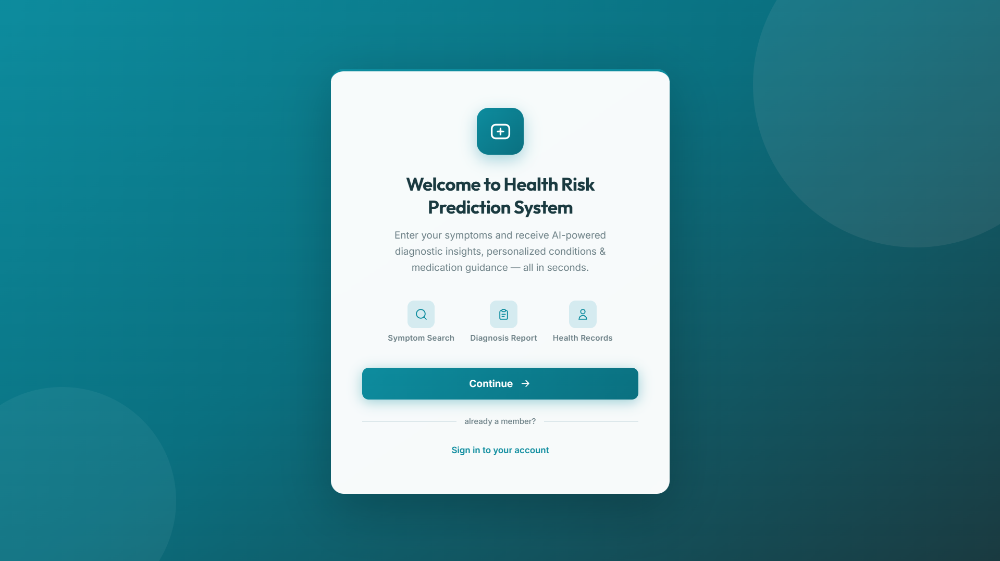
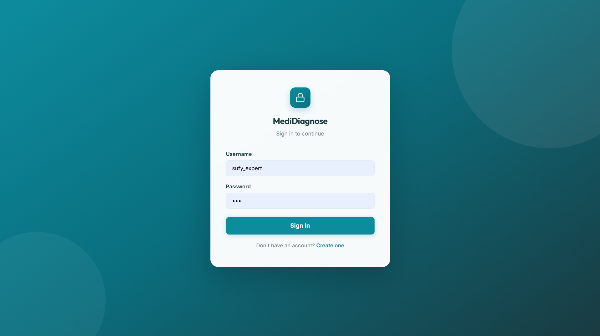
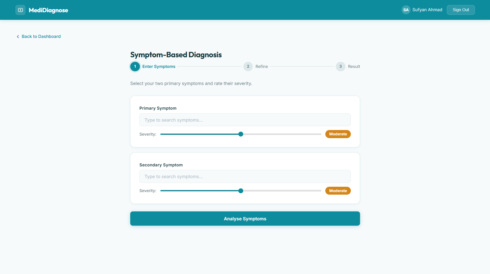
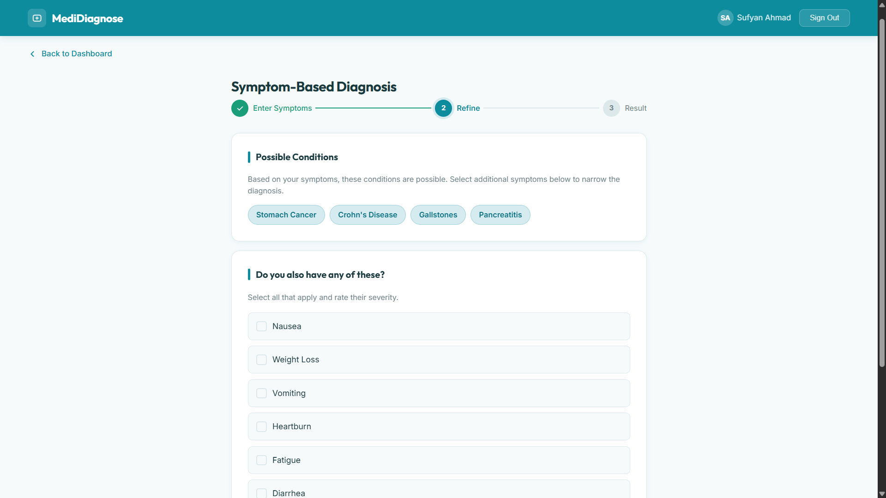
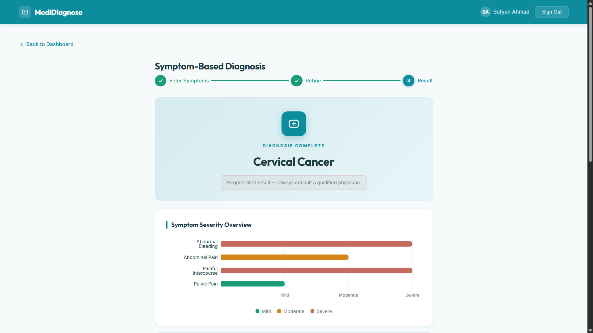
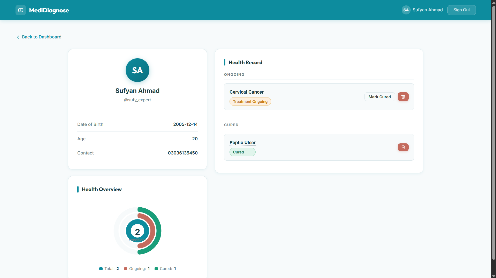

# 🏥 Medical Diagnostic System — Version 2

A full-stack AI-powered medical diagnostic web application. Users enter their symptoms and receive ranked disease predictions with dosage-specific medicine recommendations and suggested lab tests — all personalised by age.

---

## 📸 Screenshots

### Welcome Screen


### Sign Up


### Symptom Diagnosis



### Diagnostic Report


### User Profile


---

## 🛠 Tech Stack

| Layer     | Technology                                      |
|-----------|-------------------------------------------------|
| Frontend  | React.js, React Router, CSS (custom)            |
| Backend   | Python, Flask, Flask-CORS                       |
| Databases | MongoDB (users & sessions), Neo4j (knowledge graph) |
| ML / AI   | scikit-learn (Random Forest Classifier), NumPy  |
| Auth      | bcrypt password hashing                         |
| Config    | python-dotenv                                   |

---

## 🧠 Core Concepts

### Knowledge Graph (Neo4j)
The medical knowledge base lives in a Neo4j graph database with the following schema:

```
(Disease) -[:HAS_SYMPTOM]-> (Symptom)   { weight, probability }
(Disease) -[:TREATED_BY]->  (Medicine)  { adult/child/elderly dosage, note }
(Disease) -[:DIAGNOSED_BY]-> (Test)
```

At startup, the entire graph is loaded into memory for fast inference.

### Random Forest Classifier
- Built dynamically from the Neo4j knowledge base at server startup.
- Features: symptom presence/severity per disease.
- Output: top-N ranked disease predictions with confidence scores.
- Training uses data augmentation (noise injection) for better generalisation.

### Two-Step Diagnosis Flow
Diagnosis runs in two RF passes rather than one:
1. **Step 1** — the user's initial symptoms are vectorized and scored against all diseases; the top 4 candidates are returned along with the symptoms most discriminating between them (weighted by how many of the 4 candidates share each symptom).
2. **Step 2** — the user confirms which additional symptoms apply, the full symptom set is re-scored, and the final prediction is the highest-probability disease among the original top 4 (not re-opened to the full disease set).

### Age-Aware Dosage
Medicine recommendations automatically select the correct dosage tier: **child** (< 12), **adult** (12–64), or **elderly** (65+) based on the user's profile age.

---

## 📁 File Hierarchy

```
medical-diagnostic-system-ver2/
│
├── backend/
│   ├── app.py              # Flask server — all API routes + ML logic
│   └── .env                # MONGO_URI, NEO4J_URI, NEO4J_USERNAME, NEO4J_PASSWORD (not tracked)
│
├── frontend/
│   ├── public/
│   │   └── index.html
│   └── src/
│       ├── App.js               # React Router setup
│       ├── index.js
│       ├── index.css            # Global styles
│       ├── components/
│       │   └── Navbar.js
│       └── pages/
│           ├── Welcome.js
│           ├── SignIn.js
│           ├── SignUp.js
│           ├── Dashboard.js
│           ├── Diagnosis.js     # Main symptom-entry + results page
│           └── Profile.js
│
├── data/                        # Raw text knowledge base (pre-graph migration)
│   ├── knowledge.txt
│   ├── knowledge_medicines.txt
│   └── knowledge_tests.txt
│
├── src/                         # Python knowledge-builder scripts
│   ├── diseases_knowledge.py
│   ├── medicines_knowledge.py
│   ├── tests_knowledge.py
│   └── model_evaluation.py
│
├── screenshots/
├── api/
│   └── index.py                 # Vercel serverless entry point — imports backend/app.py
├── requirements.txt              # Python deps (used for both local backend and Vercel build)
├── vercel.json                   # Vercel build/routing config
└── Model_Selection_Report.md    # ML model analysis report
```

---

## 🔌 API Endpoints (Flask)

| Method | Route                                   | Description                                  |
|--------|------------------------------------------|-----------------------------------------------|
| POST   | `/api/signup`                            | Register a new user (bcrypt hash)             |
| POST   | `/api/signin`                            | Authenticate user                             |
| GET    | `/api/profile/<username>`                | Get user profile                              |
| GET    | `/api/symptoms`                          | List all known symptoms (from Neo4j)          |
| POST   | `/api/diagnose/step1`                    | Score initial symptoms, return top-4 diseases + discriminating symptoms |
| POST   | `/api/diagnose/step2`                    | Re-score with full symptom set, return final diagnosis + medicines/tests |
| GET    | `/api/disease/<disease_name>`            | Get medicines and tests for a specific disease |
| POST   | `/api/profile/<username>/disease`        | Add a diagnosed disease to the user's profile |
| PUT    | `/api/profile/<username>/disease/cure`   | Mark a disease as cured                       |
| DELETE | `/api/profile/<username>/disease`        | Remove a disease from the user's profile      |

---

## ⚙️ Setup & Run

### Backend
```bash
pip install -r requirements.txt
# Create backend/.env with MONGO_URI, NEO4J_URI, NEO4J_USERNAME, NEO4J_PASSWORD
cd backend
python app.py
```

### Frontend
```bash
cd frontend
npm install
npm start
```

### Knowledge base setup (first-time only)
The Neo4j graph is populated from the plain-text files in `data/` via the scripts in `src/`. Run once, in order, with `backend/.env` populated:
```bash
python src/diseases_knowledge.py     # loads data/knowledge.txt      → Disease/Symptom nodes
python src/medicines_knowledge.py    # loads data/knowledge_medicines.txt → Medicine nodes
python src/tests_knowledge.py        # loads data/knowledge_tests.txt → Test nodes
```

---

## ☁️ Deployment (Vercel)

The app deploys as a single Vercel project: the React build is served as static output, and `api/index.py` is registered as a Python serverless function that imports and re-exports the Flask app from `backend/app.py`. `vercel.json` routes all `/api/*` requests to that function and everything else to the static frontend build. Set `MONGO_URI`, `DB_NAME`, `NEO4J_URI`, `NEO4J_USERNAME`, and `NEO4J_PASSWORD` as Vercel project environment variables — the serverless function reads them the same way `app.py` does locally.

---

## 🔑 Environment Variables (`backend/.env`)

```
MONGO_URI=mongodb+srv://...
DB_NAME=medical_diagnostic
NEO4J_URI=neo4j+ssc://...
NEO4J_USERNAME=...
NEO4J_PASSWORD=...
```

None of these have defaults in code — the app and knowledge-base scripts will refuse to start without them.
